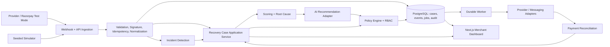

# RecoveryOS Architecture

**Status:** Proposed baseline — Phase 0 repository scaffold implemented; architecture review pending
**Owner:** RecoveryOS engineering  
**Product source of truth:** [PRD.md](./PRD.md)  
**Decision record:** [DECISIONS.md](./DECISIONS.md)  
**Data model:** [DATA_MODEL.md](./DATA_MODEL.md)

**Implementation status:** The repository baseline, SQLAlchemy persistence metadata, Alembic migration runtime, initial schema migrations, local PostgreSQL Compose service, persistence constraint tests, canonical event contract, signed webhook boundary, event idempotency, safe replay handling, source-aware obligation identity, one-case-per-obligation association, PRD-aligned audited state transitions, deterministic root-cause diagnosis, configurable integer-safe case scoring, and the provider-neutral schema-validated AI recommendation boundary are implemented. Deterministic fallback orchestration, repositories for remaining workflow operations, workers, integrations, authentication, and dashboard workflows remain planned for later phases.

## 1. Purpose and architectural goals

This document defines how the approved RecoveryOS product is structured. It does not redefine product scope, Recovery Case semantics, business rules, or success metrics; those remain in `PRD.md`.

The architecture prioritizes:

- financial correctness and authoritative reconciliation;
- explicit Recovery Case state transitions;
- idempotent event and action processing;
- deterministic policy enforcement over AI recommendations;
- durable asynchronous work;
- tenant isolation and auditable operations;
- typed contracts and modular boundaries;
- a credible Buildathon deployment without premature microservices;
- easy replacement of simulators with provider adapters.

## 2. Chosen baseline stack

| Concern | Baseline choice | Boundary |
|---|---|---|
| Repository | pnpm workspace + Turborepo | Root task orchestration and dependency graph |
| Web | Next.js with TypeScript | `apps/web`; UI composition and server/client presentation |
| Styling/UI | Tailwind CSS + shadcn-style primitives | `packages/ui`; shared tokens/components |
| API | FastAPI with Python | `apps/api`; HTTP/webhook boundary and application services |
| API schemas | Pydantic models + OpenAPI-generated TypeScript client | Explicit API contract between API and web |
| Database | PostgreSQL | Financial/workflow source of truth |
| ORM/persistence | SQLAlchemy 2.x + Alembic | API repositories and versioned migrations |
| Scheduler/worker | PostgreSQL-backed durable jobs + dedicated API worker process | No second queue required for MVP |
| AI | Provider-neutral `AIProvider`, configured external provider adapter | Structured recommendation only |
| Authentication | API-validated JWT/JWKS claims; local signed demo token | Server-side identity and RBAC |
| Testing | Pytest for API/domain; Vitest/Playwright for web and E2E | Deterministic fixtures and seeded simulator |
| Local runtime | Docker Compose for PostgreSQL and optional dependencies | Repeatable local development |

Exact framework/library versions, package names, environment variable names, deployment provider, and external AI provider are implementation decisions recorded during architecture finalization. They must not be scattered through product code.

## 3. Repository layout

The initial tree is intentionally small and domain-oriented:

```text
RecoveryOS/
├── apps/
│   ├── web/
│   │   ├── app/                    # Routes and route composition only
│   │   ├── features/               # Screen-specific composition/hooks
│   │   ├── lib/                    # API client wiring and web utilities
│   │   └── tests/                  # Web and route-level tests
│   └── api/
│       ├── app/
│       │   ├── config/             # Typed environment/runtime config
│       │   ├── domain/             # Entities, enums, invariants, transitions
│       │   ├── application/        # Use cases and orchestration
│       │   ├── scoring/            # Deterministic probability and priority
│       │   ├── policy/             # Policy precedence and decisions
│       │   ├── incidents/          # Degradation detection and correlation
│       │   ├── ai/                 # Provider adapter and output validation
│       │   ├── integrations/       # Razorpay, messaging, simulator adapters
│       │   ├── persistence/        # SQLAlchemy models, repositories, UoW
│       │   ├── workers/             # Durable job polling and handlers
│       │   ├── audit/              # Append-only audit service
│       │   ├── api/                # Routes, dependencies, serializers
│       │   └── main.py             # Runtime assembly only
│       ├── migrations/
│       └── tests/
├── packages/
│   └── ui/
│       └── src/
│           ├── components/         # Shared shadcn-style components
│           ├── global.css          # CSS variables and design tokens
│           ├── tailwind.preset.ts
│           ├── utils.ts
│           └── index.ts
├── docs/
├── scripts/                        # Seed, checks, and repository tooling
├── package.json
├── pnpm-workspace.yaml
└── turbo.json
```

`apps/web/app` may contain route composition and route-local presentation, but reusable components belong in `packages/ui/src`. The API route layer translates transport and delegates to application services; it does not contain business rules.

## 4. System shape

RecoveryOS is a modular monolith with separate web, API, and worker runtimes over one PostgreSQL database. The worker is a separately invoked process from the same API codebase so scheduled work is isolated from request latency without creating a microservice boundary.



## 5. Module responsibilities and dependency direction

### Domain

Owns `RecoveryCase`, obligation identity, states, actions, policy result enums, value objects, invariants, and legal transitions. It imports no HTTP framework, provider SDK, database session, UI, or LLM library.

### Application

Coordinates use cases such as ingesting an event, opening/associating a case, analyzing a case, evaluating policy, scheduling an action, reconciling payment success, and recording attribution. It depends on domain interfaces and repositories.

### Persistence

Implements repositories and transactions using PostgreSQL/SQLAlchemy. It owns database models, constraints, indexes, migrations, and locking details, but not product policy decisions.

### API

Owns HTTP routes, webhook signature middleware, request validation, authentication dependencies, authorization checks, response serialization, and safe error mapping. Routes delegate immediately to application services.

### Integrations

Implements `PaymentProvider`, `MessagingProvider`, `AIProvider`, and `JobScheduler` interfaces. Razorpay-specific payloads are normalized at the boundary. Simulator adapters implement the same interfaces and are explicitly labeled.

### Scoring and incidents

Scoring is deterministic, versioned, explainable, and configuration-driven. Incident detection consumes normalized event facts and writes incident associations; it does not create financial obligations.

### Policy

Evaluates the PRD precedence order and returns an immutable `PolicyDecision`. It may schedule, allow, block, suppress, stop, or require approval, but it never mutates payment truth.

### Workers

Claims durable jobs transactionally, performs last-mile rechecks, evaluates idempotency, invokes adapters, records outcomes, and schedules bounded retries. A worker cannot bypass application services or policy.

### Web and UI

The web app fetches typed API data, composes screens, and handles loading/error states. Shared visual primitives and tokens come from `packages/ui`. No financial calculation, payment status, policy, or attribution logic lives in React components.

Dependency direction:

```text
UI -> typed API client -> API routes -> application -> domain interfaces
                                              -> persistence/integrations/workers
```

Infrastructure adapters point inward through interfaces; domain code never points outward to a provider.

## 6. Event ingestion architecture

1. Provider or simulator sends a webhook/event.
2. API verifies transport authentication/signature and validates the payload.
3. A correlation ID is created or propagated.
4. The event identity is checked against the processed-event uniqueness constraint.
5. The payload is normalized into a canonical `RevenueEvent`.
6. The application service associates it with one obligation/case using identity rules.
7. Financially relevant state is reconciled from the authoritative provider adapter.
8. Analysis, scoring, incident association, and jobs are persisted transactionally where possible.
9. The endpoint acknowledges validated receipt; heavier work proceeds asynchronously.

Invalid signatures must not mutate domain state. Duplicate events are safe no-ops. A provider event must never directly set a recovered amount without server-side verification.

## 7. Case, policy, and action flow

The application service owns the explicit state transition matrix in the PRD. A recommendation is persisted with evidence, source, confidence, scoring/model version, and policy context. Policy evaluates in this order: authoritative success, opt-out, terminal state, duplicate/invalid/stale, incident suppression, contact limits, minimum interval, quiet hours, approval threshold, channel availability, then normal allow.

Scheduled actions are rows in the durable job table with a deduplication key. The worker claims a job, rechecks payment/case/opt-out/incident/policy state, then invokes the adapter exactly once per idempotency key. Success events cancel future jobs and reconcile the case.

## 8. Database and transaction approach

PostgreSQL is the source of truth for cases, obligations, events, attempts, jobs, policies, recommendations, incidents, experiments, attribution, and audit events. Monetary values use integer smallest units. Uniqueness and foreign-key constraints enforce obligation and event identity.

Transactions are required for:

- event idempotency insertion and case association;
- state transition plus audit event;
- job claim plus lease metadata;
- payment success reconciliation plus future-job cancellation;
- action idempotency reservation plus action result;
- policy version capture with each decision.

Concurrent handlers use unique constraints and/or row-level locking rather than application-only checks. Migrations are versioned with Alembic and run explicitly during deployment.

## 9. Scheduler and worker

The MVP uses PostgreSQL-backed jobs instead of introducing Redis or a hosted queue. This keeps the financial workflow durable and reduces operational surface area. A worker polls due jobs, claims them using a lease/lock, executes bounded handlers, and records attempts.

Required job fields include job identity, case/action identity, type, due time, status, attempt count, lease expiry, next retry time, idempotency key, last error category, and correlation ID. Startup reconciliation finds expired leases and reconstructs eligible jobs from open case state.

After the configured retry limit, a job enters a dead-letter status for operator review/replay. Replay preserves the original identity and passes through all rechecks.

## 10. AI provider architecture

`AIProvider` is an adapter boundary. The application sends a minimized, tenant-scoped evidence view and receives a schema-validated recommendation. The provider adapter owns request formatting, prompt/model version references, timeout, provider errors, and redaction. The application owns confidence handling, registered action validation, policy evaluation, and persistence.

The deterministic scorer is always available. If AI fails, the application uses the configured deterministic fallback or safe wait/escalation. No provider SDK types or prompts may leak into domain modules. AI configuration is environment/provider configuration; per-merchant business policy remains persisted policy.

## 11. Provider adapter architecture

The following interfaces are required at the application boundary:

- `PaymentProvider`: verify payment/order status, create permitted payment links/retry paths, reconcile events.
- `MessagingProvider`: send an approved channel message with an idempotency key and return delivery status.
- `AIProvider`: return a structured recommendation or typed failure.
- `JobScheduler`: schedule, cancel, claim, retry, and dead-letter durable work.
- `Clock`: provide injectable time for deterministic tests and race scenarios.

Initial implementations are Razorpay-style/test-mode, simulated messaging, deterministic simulator, configured AI provider, and PostgreSQL scheduler. Each implementation exposes health and failure state without changing domain contracts.

## 12. Authentication, authorization, and tenancy

The API validates bearer JWT claims using a configurable signing key or JWKS source. Local demo mode may issue a short-lived signed token from a seeded identity; production deployment must use an approved identity provider and key rotation process. The API extracts subject, merchant/tenant scope, role, token expiry, and correlation metadata.

Viewer, Operator, and Admin permissions are enforced in API dependencies/application services. Every query and mutation requires merchant scope. The frontend may hide unavailable controls but cannot grant access. Admin-only policy/integration/simulator changes require audit events.

## 13. Configuration architecture

Typed startup configuration loads safe structural defaults, environment configuration, merchant policy from PostgreSQL, and explicitly scoped experiment overrides. Secrets are environment/secret-manager inputs only. Mutable business values are never scattered constants.

Configuration validation covers durations, timezones, probabilities, amounts, enums, URLs, provider modes, retry limits, and required credentials. The effective policy version and configuration references are persisted with decisions, jobs, actions, and audit events.

Feature flags are explicit, tenant/environment scoped, and default-safe. Demo mode, synthetic data, simulated messaging, and simulated degradation are visible in the UI.

## 14. Deployment architecture

The initial deployment shape is:

- one Next.js web runtime;
- one FastAPI API runtime;
- one worker runtime using the same API package;
- one managed PostgreSQL instance;
- one configured secret store/environment mechanism;
- optional external AI and messaging providers behind adapters.

Local development uses Docker Compose for PostgreSQL and the documented pnpm/Turborepo commands. CI must install with the lockfile, validate configuration shape, run lint/format/typecheck/unit/integration/build/E2E gates, and build deployable web/API/worker artifacts. Exact hosting, scaling, TLS, backup, and migration rollout decisions remain deployment ADR items.

## 15. Observability and failure handling

Use structured logs with `merchant_id`, `case_id`, `event_id`, `payment_id`, `action_id`, `job_id`, `incident_id`, and `correlation_id`. Expose liveness/readiness checks for API, database, worker, provider configuration, and migration state. Track webhook, case, policy, job, provider, AI, incident, and recovery metrics described in the PRD.

Failure behavior is fail-closed for payment truth and customer contact. Invalid signatures do not mutate state; stale jobs are cancelled after recheck; AI errors use deterministic fallback; provider failures use bounded retry/backoff; database outages do not claim success; repeated failures go to dead-letter state; startup reconciliation repairs expired leases and unresolved work.

## 16. Security and maintainability controls

Use TLS in deployed environments, encrypted managed database storage, secret rotation, input validation, rate limiting, tenant-scoped authorization, PII minimization, log redaction, append-only audit records, dependency scanning, and no raw payment credentials. These controls are detailed in future `docs/SECURITY.md` when hardening begins.

Code quality requires typed interfaces, focused modules, pure financial/scoring functions, versioned migrations, no route/UI business logic, no duplicated policy, and no page over approximately 400–500 lines without a documented exception.

## 17. Architecture validation gates

Before implementation begins:

- confirm this stack and alternatives in `DECISIONS.md`;
- review the data constraints in `DATA_MODEL.md`;
- define concrete package versions and commands;
- define the API contract generation path;
- define migration and local database commands;
- define the first vertical slice test fixture;
- define deployment environment configuration and secret names;
- confirm CI quality gates;
- confirm no conflicting repository instructions exist.

After each vertical slice, run the relevant checks and update the affected docs before committing and pushing.
