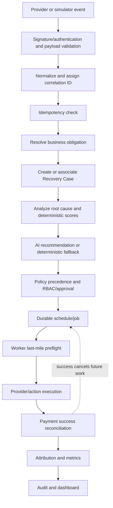
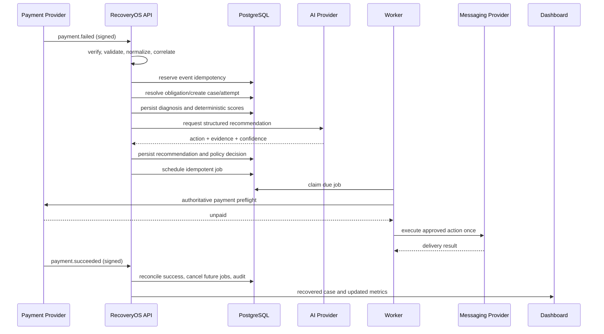

# RecoveryOS Application Flow

**Status:** Proposed implementation contract  
**Implementation status:** No application code exists yet  
**Product source:** [PRD.md](./PRD.md)  
**Architecture:** [ARCHITECTURE.md](./ARCHITECTURE.md)  
**Data model:** [DATA_MODEL.md](./DATA_MODEL.md)

## 1. Purpose and scope

This document describes how a RecoveryOS revenue-risk event travels through ingestion, case analysis, bounded decisioning, action execution, reconciliation, attribution, audit, and dashboard reporting. It is a behavioral flow contract, not a public HTTP API specification or a replacement for the PRD.

The repository is currently documentation-only. Every component named here is `PROPOSED` or `PLANNED` until implemented and verified.

## 2. Actors

| Actor | Responsibility | Trust boundary |
|---|---|---|
| Merchant | Owns policies, obligations, integrations, and recovery goals | Tenant authority; authenticated users only |
| Customer | Creates payment/checkout/invoice activity and may pay or opt out | Untrusted external actor |
| Payment provider | Emits payment events, exposes authoritative status, and may create permitted payment paths | External provider; adapter boundary |
| Messaging provider | Delivers approved email/SMS/WhatsApp-style actions | External provider; simulated in MVP unless configured |
| AI provider | Interprets evidence and recommends registered actions | Untrusted advisory dependency |
| RecoveryOS API | Validates input, coordinates application services, and exposes data/actions | Authenticated application boundary |
| Worker | Claims durable jobs, rechecks state, and executes approved actions | Internal privileged runtime |
| Scheduler | Persists/claims due work through the job abstraction | Internal infrastructure boundary |
| Incident detector | Correlates normalized payment outcomes into probable incidents | Deterministic internal module |
| Simulator | Generates reproducible synthetic events and provider outcomes | Explicit demo/test boundary |
| Dashboard | Presents cases, decisions, health, and measured recovery | Presentation only; never financial authority |

## 3. High-level flow



## 4. Core event flow

The canonical example is a failed UPI payment followed by a scheduled recovery path. The same flow is reused for checkout, subscription, and invoice obligations after source-specific normalization.

### Step 1 — Event received

- **Input:** Provider/simulator request, event type, provider event ID, source object, payload, and transport metadata.
- **Processing:** API receives the event at the ingestion boundary and creates or propagates a correlation ID.
- **Output:** Request enters validation; no case or financial mutation yet.
- **Responsible component:** API ingestion route and integration boundary.
- **Persistence:** Request receipt/processing status may be recorded; raw payload retention is minimized.
- **Failure:** Return a safe error or provider-compatible acknowledgement according to retry policy; do not claim business processing.
- **Idempotency:** Provider event ID is the first candidate identity.
- **Security:** Treat payload and customer fields as untrusted; do not log secrets or unnecessary PII.

### Step 2 — Signature/authentication validation

- **Input:** Event body, signature headers, configured provider secret/key material.
- **Processing:** Verify signature and replay constraints where provider metadata supports them.
- **Output:** Authenticated event or rejection.
- **Responsible component:** Webhook security middleware/integration adapter.
- **Persistence:** A rejected security event may create safe security telemetry, but no domain record.
- **Failure:** Reject invalid signatures without case, attempt, job, or financial mutation.
- **Idempotency:** Rejected events do not consume business idempotency.
- **Security:** Secrets are loaded from environment/secret management and never returned/logged.

### Step 3 — Input validation

- **Input:** Authenticated provider payload.
- **Processing:** Validate event type, required IDs, timestamps, merchant scope, amount/currency when applicable, and supported schema version.
- **Output:** Typed provider event or safe validation error.
- **Responsible component:** Pydantic/API schema layer and adapter.
- **Persistence:** Invalid payload status may be recorded for operations.
- **Failure:** No domain mutation; retry only when the error is classified retryable.
- **Idempotency:** Validation precedes processing but accepted identity remains provider-scoped.
- **Security:** Reject oversized, malformed, unexpected, or unsafe fields.

### Step 4 — Normalization

- **Input:** Provider-specific event.
- **Processing:** Map it to canonical `RevenueEvent` facts: event type, source object, obligation references, amount/currency, method, failure code, timestamps, provider identity, and correlation ID.
- **Output:** Canonical event suitable for application services.
- **Responsible component:** Integration adapter and normalization module.
- **Persistence:** Persist normalized event and processing status.
- **Failure:** Typed integration/validation error; do not guess missing financial fields.
- **Idempotency:** Provider identity remains attached to canonical identity.
- **Security:** Normalize only required PII and redact raw payloads.

### Step 5 — Event identity and idempotency

- **Input:** Canonical event identity and merchant/provider scope.
- **Processing:** Insert/check `processed_events` under a unique constraint.
- **Output:** New event to process or safe duplicate result.
- **Responsible component:** Event application service and persistence transaction.
- **Persistence:** `processed_events`, `revenue_events`.
- **Failure:** Retry transaction safely; never process an uncertain event twice without identity checks.
- **Idempotency:** Duplicate event is a no-op and returns the prior result.
- **Security:** Tenant scope is part of the lookup; one merchant cannot suppress another merchant's event.

### Step 6 — Obligation identification

- **Input:** Canonical event and source-specific IDs.
- **Processing:** Resolve order, checkout intent, subscription billing cycle, or invoice identity.
- **Output:** Existing obligation, new obligation, or unresolved/invalid obligation.
- **Responsible component:** Obligation identity application service.
- **Persistence:** `obligations` and related external references.
- **Failure:** Unresolved events are quarantined/reported; they are not counted as recoverable money.
- **Idempotency:** Identity is unique per merchant and obligation scope.
- **Security:** External IDs are always resolved within merchant scope.

### Step 7 — Case creation or association

- **Input:** Resolved obligation and event.
- **Processing:** Create one case or attach a payment attempt/event to the existing case.
- **Output:** `RecoveryCase` in `DETECTED` or reconciled terminal state.
- **Responsible component:** Recovery Case application service.
- **Persistence:** `recovery_cases`, `payment_attempts`, `revenue_events`, audit event.
- **Failure:** Transaction rollback; concurrent unique conflict reloads the existing case.
- **Idempotency:** One case per recoverable obligation, not one per webhook/attempt.
- **Security:** Merchant and customer scope are enforced.

### Step 8 — Case analysis

- **Input:** Case, attempts, source event, customer metadata, payment history, policy context, and incident signals.
- **Processing:** Transition to `ANALYZING`; build an evidence snapshot.
- **Output:** Evidence available for diagnosis and scoring.
- **Responsible component:** Case analysis application service.
- **Persistence:** Case evidence/recommendation inputs and audit transition.
- **Failure:** Preserve case as open; use unknown evidence and safe fallback rather than inventing facts.
- **Idempotency:** Re-analysis creates a versioned snapshot, not a duplicate case.
- **Security:** Evidence is tenant-scoped and minimized before AI use.

### Step 9 — Root-cause classification

- **Input:** Failure code, attempt history, method, timing, customer context, and incident facts.
- **Processing:** Deterministically classify temporary failure, bank issue, insufficient funds, expired card, authentication failure, mandate failure, cancellation, abandonment, systemic degradation, invalid instrument, merchant configuration, or unknown.
- **Output:** Root cause, confidence, evidence, and diagnosis version.
- **Responsible component:** Diagnosis/scoring module.
- **Persistence:** Case analysis snapshot and audit.
- **Failure:** `UNKNOWN`/low confidence; no unsafe action is implied.
- **Idempotency:** Same evidence/version produces the same result.
- **Security:** No sensitive provider credential is included.

### Step 10 — Deterministic scoring

- **Input:** Configured scoring coefficients and evidence features.
- **Processing:** Calculate recovery probability, confidence, Expected Recoverable Revenue, and priority.
- **Output:** Versioned score snapshot and explanation.
- **Responsible component:** Pure scoring module.
- **Persistence:** Case score fields and evidence snapshot.
- **Failure:** Configuration validation/fallback; never use an unbounded or invented score.
- **Idempotency:** Repeated calculation with same version/context is safe.
- **Security:** Scoring inputs are access-controlled and logged without unnecessary PII.

### Step 11 — Expected Recoverable Revenue

```text
Expected Recoverable Revenue = Amount at Risk × Probability of Recovery
```

The amount is an integer smallest-unit value and the probability is clamped to `[0,1]`. This calculation is deterministic and cannot be supplied by the AI provider. Expected value is a prioritization estimate, not recovered revenue.

### Step 12 — AI recommendation

- **Input:** Minimized case evidence, scoring explanation, registered action catalog, and policy context.
- **Processing:** AI interprets evidence and proposes one registered action, timing, reason, evidence, confidence, and fallback.
- **Output:** Raw provider response inside the AI adapter boundary.
- **Responsible component:** `AIProvider` adapter and recommendation service.
- **Persistence:** Recommendation source/version/status after validation.
- **Failure:** Timeout/unavailable/invalid output goes to deterministic fallback, safe wait, or escalation.
- **Idempotency:** Recommendation identity/version prevents duplicate workflow effects; it never authorizes execution.
- **Security:** Untrusted event content is not treated as instructions; inputs are redacted/minimized.

### Step 13 — Structured validation

The recommendation schema validates action enum, parameters, delay, reason code, evidence references, confidence range, prompt/model version, and fallback. Unknown actions, arbitrary tools, financial-state claims, invalid ranges, and unsupported recipients are rejected. A rejected recommendation is not a policy-approved action.

### Step 14 — Policy evaluation

The deterministic policy engine applies: authoritative success → opt-out → terminal → duplicate/invalid/stale → incident suppression → limits → minimum interval → quiet hours → approval threshold → channel availability → normal allow. It returns `ALLOW`, `BLOCK`, `SCHEDULE`, `SUPPRESS`, `REQUIRE_APPROVAL`, or `STOP` with policy version and decisive rule.

### Step 15 — Scheduling

- **Input:** Allowed/scheduled action and policy decision.
- **Processing:** Persist a durable job with due time, lease/retry settings, action idempotency key, and policy version.
- **Output:** `SCHEDULED` case/job.
- **Responsible component:** Scheduler/application service.
- **Persistence:** `scheduled_jobs`, `recovery_actions`, audit event.
- **Failure:** Transaction rollback or retry; no untracked timer.
- **Idempotency:** Unique job/action key prevents duplicates.
- **Security:** Only authorized application paths create jobs.

### Step 16 — Payment/status preflight

Before any customer-facing or payment action, the worker rechecks authoritative payment/order status, case state, opt-out, active incident, current policy, channel, and action idempotency. If payment is already successful, the job is cancelled and the case is reconciled. If verification is unavailable, the action waits/retries/escalates; it must not contact blindly.

### Step 17 — Action execution

- **Input:** Approved action, fresh preflight snapshot, action idempotency key.
- **Processing:** Invoke the registered provider adapter once.
- **Output:** Provider reference and action delivery/result status.
- **Responsible component:** Worker/action service and adapter.
- **Persistence:** `recovery_actions`, job state, audit/metrics.
- **Failure:** Typed retryable/terminal failure with bounded backoff or dead-letter status.
- **Idempotency:** Provider reference is reused on retry; no duplicate external effect.
- **Security:** Authorization and policy are rechecked; no secret enters logs.

### Step 18 — Reconciliation

Payment success is accepted only from the authoritative provider or verified simulator source. Reconciliation binds success to the obligation/payment identity, updates recovered amount once, cancels future jobs, and transitions the case to `RECOVERED`. Messages, clicks, recommendations, and simulator counters cannot establish financial truth.

### Step 19 — Success cancellation

Success, opt-out, cancellation, exhaustion, or suppression cancels applicable future jobs. Cancellation is idempotent and auditable. A stale worker must observe cancellation and produce no customer-facing effect.

### Step 20 — Attribution

The case is assigned to control/treatment before treatment. A verified success is classified as natural or assisted within the configured case-level attribution window. Duplicate success events are no-ops; refunds/reversals become explicit adjustments. Attribution measures product lift; it does not by itself prove causal certainty.

### Step 21 — Audit

Audit events cover event acceptance/rejection, case creation/association, state changes, recommendations, policy decisions, approvals, job/action lifecycle, cancellations, provider failures, reconciliation, attribution, policy/configuration changes, simulator runs, and privileged access.

### Step 22 — Dashboard/reporting

The dashboard reads typed API projections for revenue at risk, expected recoverable value, recovered revenue, natural/assisted recovery, active cases, incidents, approvals, system health, and audit timelines. It displays freshness and synthetic/simulated labels. It never calculates or mutates financial truth client-side.

## 5. Alternate flows

| Scenario | Required flow | Financial/action effect |
|---|---|---|
| Duplicate webhook | Idempotency lookup returns prior result | No new case, attempt, or amount |
| Duplicate event after processing failure | Retry same identity transactionally | One eventual domain effect |
| Concurrent case creation | Unique obligation constraint; loser reloads case | One case, multiple attempts |
| Payment before outreach | Success event reconciles/cancels job | No outreach; recovered once |
| Payment during worker execution | Preflight/transaction/idempotency coordination | No duplicate effect; reconcile ambiguity |
| AI timeout | Deterministic fallback or wait/escalate | Policy still applies |
| AI unavailable | Adapter typed failure | No workflow safety degradation |
| Malformed AI response | Schema rejection and fallback | No action execution |
| Policy rejection | Persist decisive rule and block/schedule/suppress | No forbidden effect |
| Customer opt-out | Cancel future contact and close/suppress case | No later customer outreach |
| Incident suppression | Associate cases, cancel/delay jobs | No mass outreach or extra obligation |
| Provider failure | Classify, retry/backoff, or dead-letter | No false recovery |
| Worker restart | Recover expired leases and due jobs | No lost/duplicate action |
| Retry | Recheck and reuse idempotency key | At most one external effect |
| Dead-letter | Isolate after configured attempts | Operator review/replay only |
| Replay | Preserve event/job identity | Safe idempotent reprocessing |
| Refund/reversal | Append adjustment/reconciliation event | Net reporting changes explicitly |

## 6. Synchronous versus asynchronous flow

### Synchronous

- Webhook signature/authentication and payload validation.
- Idempotency reservation and accepted-event persistence.
- Lightweight obligation/case association where transactionally safe.
- API reads for dashboard/case/health data.
- Policy evaluation for an immediate decision.
- Last-mile preflight before an external action.

### Asynchronous

- Root-cause analysis and scoring when processing is heavy.
- AI recommendation calls.
- Incident window aggregation.
- Scheduled jobs and retries.
- Provider messaging/payment-link calls.
- Payment success reconciliation triggered by later events.
- Attribution and reporting refreshes.

The database-backed job table is the durable handoff. In-process timers are not the source of truth.

## 7. Financial truth flow

```text
Authoritative provider/simulator status
  -> verified normalized success event or server-side status lookup
  -> payment/obligation identity reconciliation
  -> one case recovered amount
  -> attribution adjustment/reporting
```

Financial truth does not originate from the browser, webhook delivery alone, message delivery, link click, AI output, recommendation, incident count, retry count, or simulator counters. The simulator may create a verified synthetic provider outcome, but the outcome still flows through reconciliation.

## 8. AI decision flow

```text
Evidence snapshot
  -> AIProvider recommendation
  -> schema/allow-list/range validation
  -> deterministic policy precedence
  -> approval when required
  -> durable schedule or execution
  -> preflight recheck
```

AI cannot determine whether a payment succeeded, change an amount, authorize a merchant action, bypass opt-out/quiet-hours/contact limits, create arbitrary tools, or mutate financial state. AI failure always has a deterministic safe path.

## 9. Incident flow

```text
Rolling payment outcomes
  -> configurable baseline/current comparison
  -> probable Incident with evidence/confidence
  -> case association
  -> SUPPRESS/WAIT policy
  -> monitor resolution threshold and cooldown
  -> re-evaluate unresolved cases
  -> targeted recovery
```

An Incident is operational context, not a financial obligation. Suppression and resolution are visible in case timelines and metrics.

## 10. Failure and recovery matrix

| Failure | Detection | Response | Retry | Financial impact | Audit |
|---|---|---|---|---|---|
| Invalid signature | Middleware verification | Reject, security telemetry | Provider may retry | No mutation | Security event |
| Invalid payload | Schema validation | Safe error/quarantine | Only retryable classes | No amount counted | Processing failure |
| Duplicate event | Unique idempotency lookup | No-op prior result | No business retry | No duplicate amount | Duplicate metric |
| Database unavailable | Connection/readiness check | Fail safe, preserve retryability | Bounded infrastructure retry | No false success | Health/error record |
| AI timeout | Adapter timer | Fallback/wait/escalate | Configured retry only | No financial effect | AI fallback |
| Malformed AI output | Schema validator | Reject and fallback | No blind retry | No action effect | Recommendation rejection |
| Policy block | Policy evaluator | Block/schedule/suppress | Only if policy says | No forbidden contact | Policy decision |
| Provider action error | Adapter response/timeout | Retry/backoff/fallback/DLQ | Configured bounded retry | No recovered amount | Action failure |
| Stale job | Last-mile preflight | Cancel/re-evaluate | Re-schedule only if allowed | No stale outreach | Cancellation |
| Worker crash | Lease expiry/health | Reclaim/reconcile | Idempotent retry | No duplicate effect | Worker/job event |
| Incident degradation | Detector thresholds | Suppress/delay | Monitor resolution | No extra obligation | Incident/suppression |
| Refund/reversal | Provider adjustment | Append adjustment | Reconcile as configured | Net amount adjusted | Financial adjustment |

## 11. End-to-end sequence


